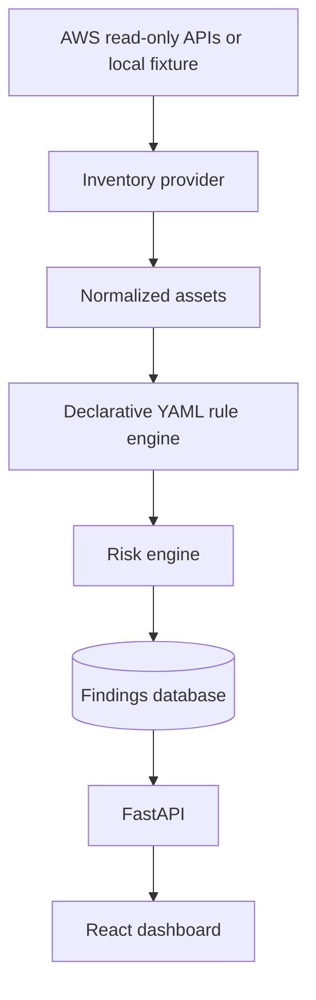

# Architecture

## V1 data flow

The scanner, rule evaluator and risk model are separate on purpose. This lets
us test them independently and later add event-based detection without mixing
CloudTrail semantics into CSPM rules.

## Boundaries

- **Inventory providers** normalize cloud-specific data into `Asset` objects.
- **Rule engine** evaluates deterministic conditions from YAML.
- **Risk engine** adds business context and explains every point awarded.
- **Repository** deduplicates findings with a stable SHA-256 fingerprint.
- **API** is an orchestration boundary, not the location of security logic.

## Security foundation additions

Bearer authentication resolves tenant and role from server configuration before
data access. Finding storage uses (tenant, source, fingerprint) as its identity.
Scan history and audit are tenant-scoped. A database-backed scan lock prevents
overlapping writers within an organization. The initial running record and audit
event commit before collection; final findings, outcome and audit commit together.
Failed collection retains prior findings. An interrupted process retains its lock
until explicit offline recovery. This favors safety over automatic availability.

No dedicated workers, RLS or OIDC are implemented in this increment. See
[security-foundation.md](security-foundation.md) for exact boundaries and recovery.

## Deliberate V1 decisions

1. A modular monolith is preferable to microservices at this scale. It keeps
   transactions, testing and deployment understandable.
2. Scans are synchronous in V1. Move them to a queue only when measured scan
   duration justifies Redis/Celery.
3. SQLite is the default developer database; PostgreSQL is the container and
   future production target.
4. Kubernetes is excluded. ECS/Fargate would be simpler for the first hosted
   version.

## Next architectural increment

V2 should add an asynchronous scan job model, CloudTrail ingestion to S3/SQS,
normalized events, detection rules and time-window correlation. It should not
reuse CSPM findings as if they were security events.
